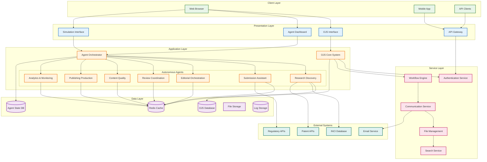
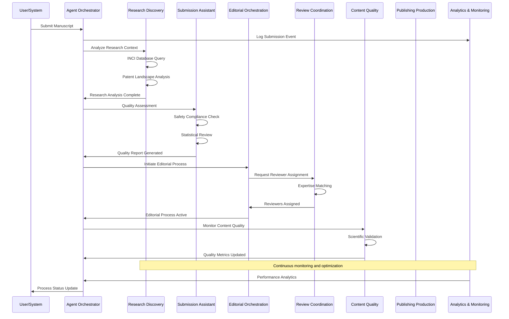
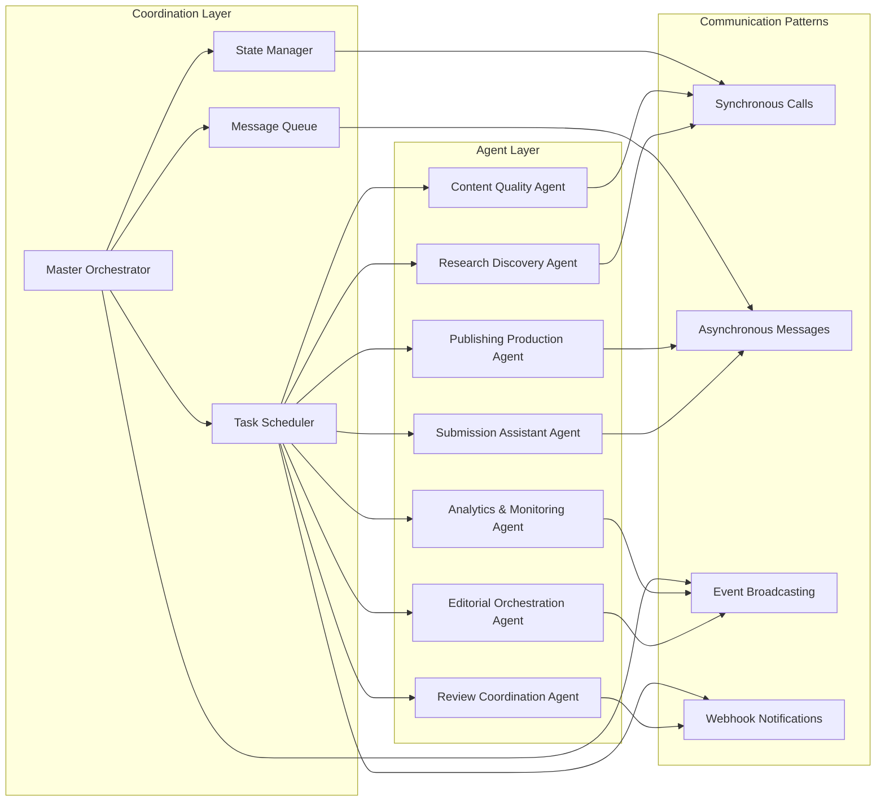
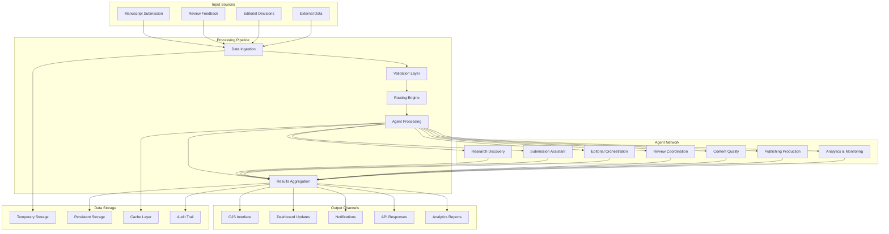
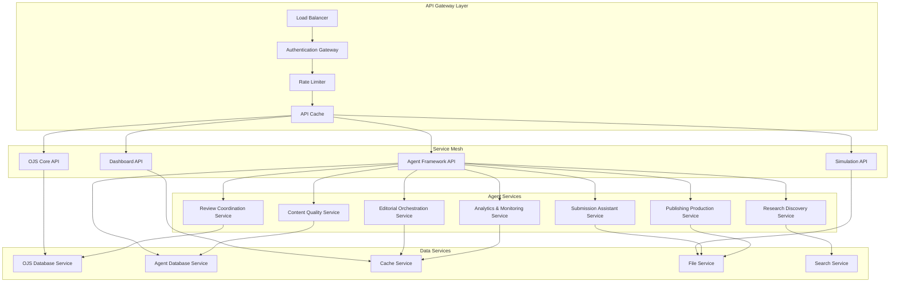
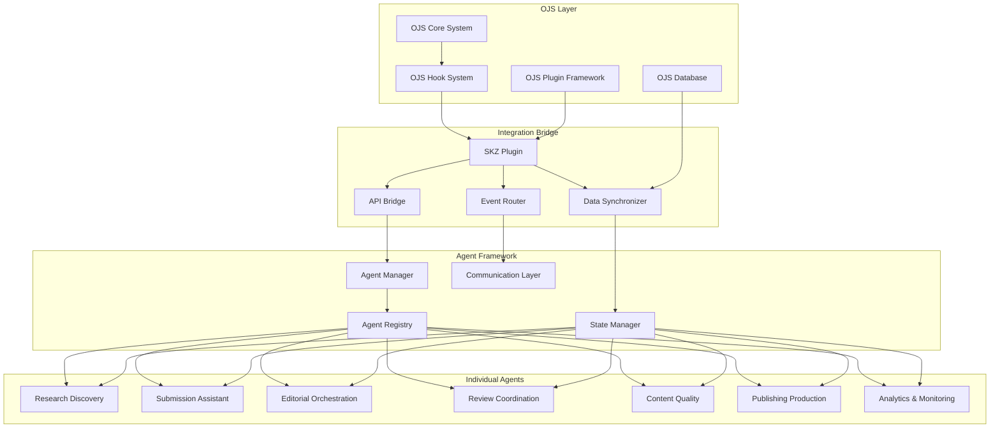
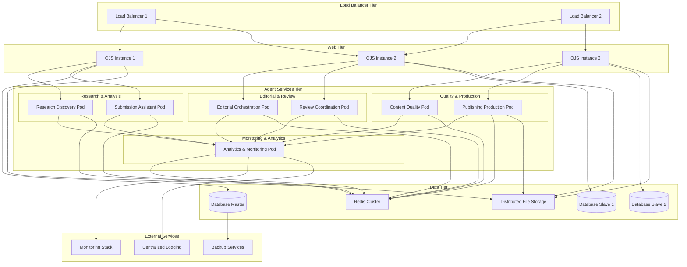
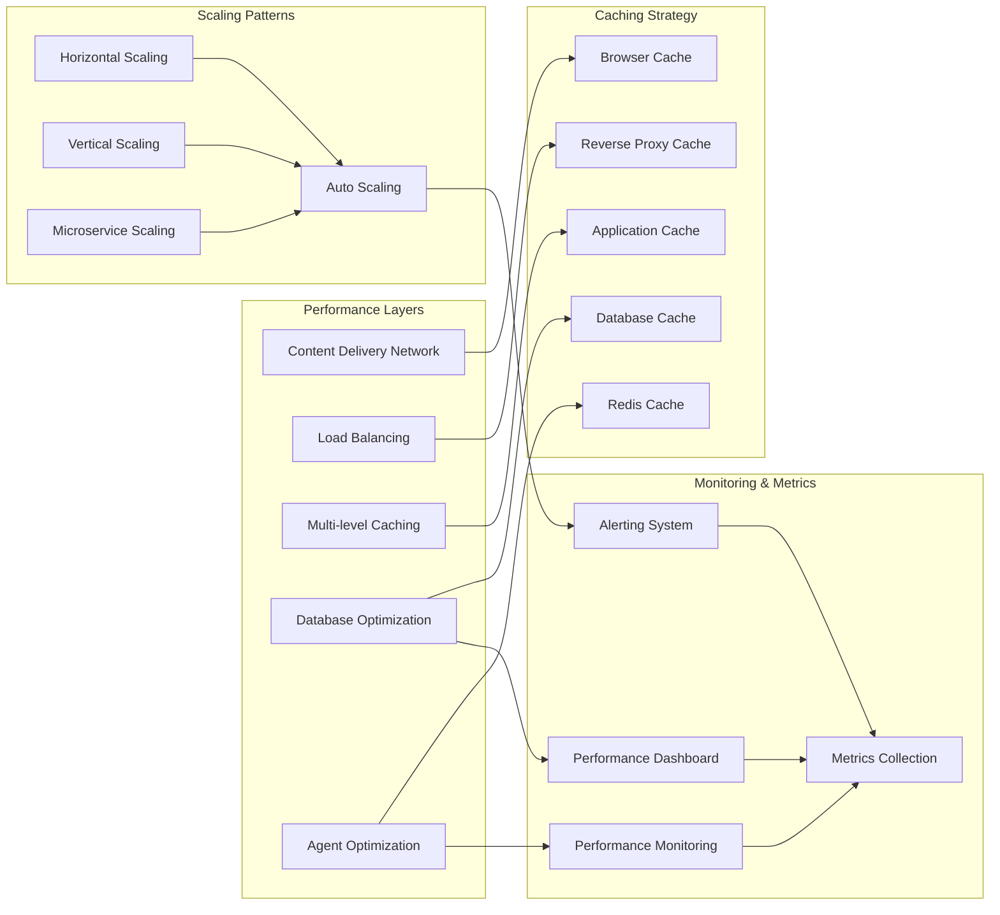
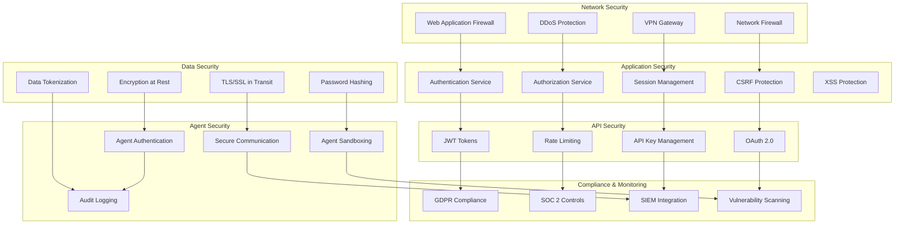
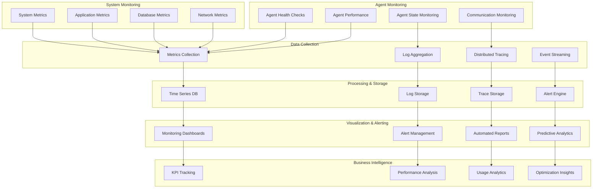

# Technical Architecture & Orchestration Documentation

## Table of Contents
1. [System Overview](#system-overview)
2. [Architecture Layers](#architecture-layers)
3. [Agent Orchestration](#agent-orchestration)
4. [Data Flow & Communication](#data-flow--communication)
5. [Integration Patterns](#integration-patterns)
6. [Deployment Architecture](#deployment-architecture)
7. [Performance & Scalability](#performance--scalability)
8. [Security Architecture](#security-architecture)
9. [Monitoring & Observability](#monitoring--observability)

## System Overview

The Enhanced OJS with SKZ integration represents a revolutionary academic publishing platform that combines traditional Open Journal Systems capabilities with 7 autonomous AI agents for complete workflow automation.

### High-Level Architecture

## Architecture Layers

### 1. Client Layer
- **Web Browser**: Standard browser access to OJS and agent interfaces
- **Mobile Applications**: Responsive mobile access to core functionality
- **API Clients**: Third-party integrations and automated systems

### 2. Presentation Layer
- **OJS Interface**: Enhanced traditional OJS interface with agent features
- **Agent Dashboard**: Real-time monitoring and control of autonomous agents
- **Simulation Interface**: Agent behavior testing and validation environment
- **API Gateway**: Centralized API access point with authentication and routing

### 3. Application Layer
- **OJS Core System**: Traditional journal management functionality
- **Agent Orchestrator**: Central coordination system for all autonomous agents
- **7 Autonomous Agents**: Specialized AI agents for workflow automation

### 4. Service Layer
- **Authentication Service**: User management and security
- **Workflow Engine**: Process coordination and state management
- **Communication Service**: Inter-agent and user communication
- **File Management**: Document storage and versioning
- **Search Service**: Content indexing and retrieval

### 5. Data Layer
- **OJS Database**: Core journal data storage
- **Agent State Database**: Agent configuration and state persistence
- **Redis Cache**: High-performance caching layer
- **File Storage**: Document and media storage
- **Log Storage**: Audit trails and system logs

## Agent Orchestration

### Agent Communication Patterns

### Agent Coordination Framework

## Data Flow & Communication

### Information Flow Architecture

### API Communication Architecture

## Integration Patterns

### OJS-Agent Integration Architecture

## Deployment Architecture

### Container Orchestration

## Performance & Scalability

### Performance Optimization Strategy

## Security Architecture

### Security Layers and Controls

## Monitoring & Observability

### Comprehensive Monitoring Architecture

---

This comprehensive technical architecture documentation provides detailed insights into the Enhanced OJS with SKZ integration system, covering all major architectural components, integration patterns, and operational considerations for successful deployment and maintenance.