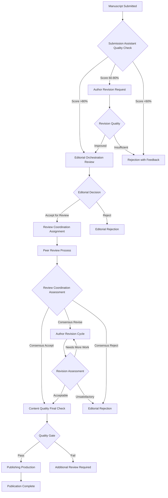
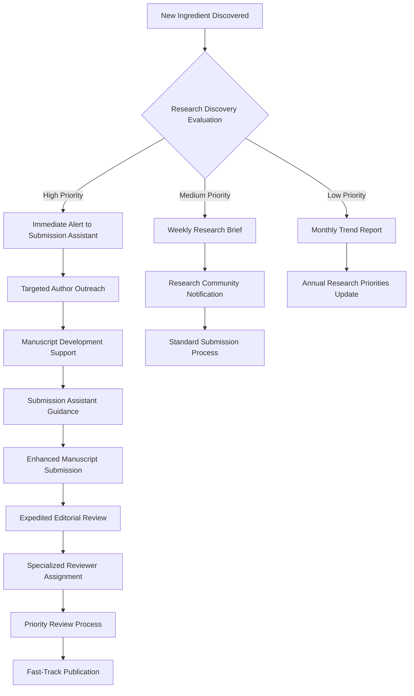
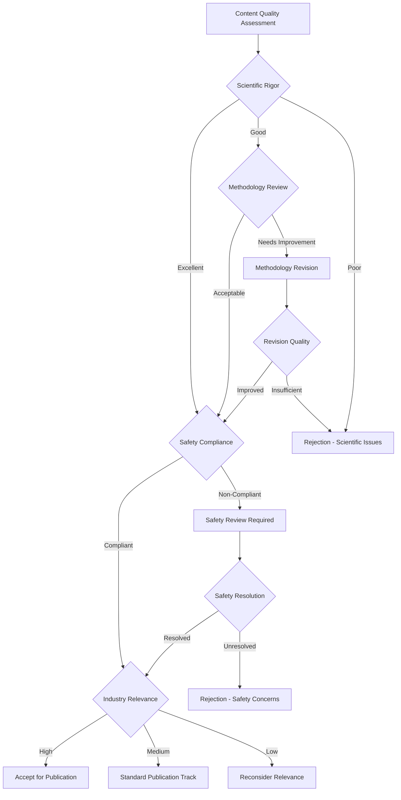

# Skin Zone Journal - Agent Interaction Patterns and Decision Flows

## Overview

This document defines the sophisticated interaction patterns and decision flows between the 7 autonomous agents in the Skin Zone Journal ecosystem. The design balances hierarchical coordination for priority management with distributed networks for innovation fostering, creating a dynamic and adaptive research publication system.

## Interaction Architecture

### Core Principles
1. **Hierarchical Priority Management**: Editorial Orchestration Agent serves as central coordinator
2. **Distributed Innovation Networks**: Research Discovery and Submission Assistant agents operate autonomously
3. **Quality Gates**: Content Quality Agent enforces standards at critical decision points
4. **Continuous Feedback**: Analytics Agent provides real-time optimization data to all agents

### Communication Protocols
- **Synchronous Communication**: Real-time coordination for time-critical decisions
- **Asynchronous Messaging**: Background information sharing and status updates
- **Event-Driven Triggers**: Automated responses to specific conditions or thresholds
- **Batch Processing**: Periodic bulk data exchanges and performance reviews

## Agent Interaction Matrix

### Primary Interaction Flows

#### 1. Research Discovery → Submission Assistant
**Trigger**: New ingredient or trend identified
**Flow Type**: Asynchronous notification with data package
**Decision Points**:
- Relevance threshold (>85% match to journal scope)
- Safety data availability (complete/partial/missing)
- Market potential score (>70% commercial viability)
- Regulatory status (approved/pending/restricted)

**Data Exchange**:
```json
{
  "ingredient_id": "INCI_12345",
  "discovery_confidence": 0.92,
  "safety_profile": "complete",
  "market_potential": 0.78,
  "regulatory_status": "approved_eu_us",
  "research_gaps": ["long_term_stability", "sensitive_skin_testing"],
  "priority_level": "high"
}
```

#### 2. Submission Assistant → Editorial Orchestration
**Trigger**: Manuscript submission or quality assessment complete
**Flow Type**: Synchronous handoff with quality metrics
**Decision Points**:
- Quality score threshold (>80% for automatic acceptance to review)
- Completeness check (all required sections present)
- Novelty assessment (>60% innovation score)
- Safety compliance (100% regulatory adherence required)

**Decision Tree**:
```
Manuscript Quality Score
├── >90%: Fast-track to specialized reviewers
├── 80-90%: Standard review process
├── 60-80%: Minor revisions required
└── <60%: Major revisions or rejection
```

#### 3. Editorial Orchestration → Review Coordination
**Trigger**: Manuscript approved for peer review
**Flow Type**: Synchronous assignment with reviewer matching
**Decision Points**:
- Reviewer expertise match (>85% relevance required)
- Reviewer availability (within 2 weeks response time)
- Conflict of interest check (industry affiliations)
- Workload balance (max 3 active reviews per reviewer)

**Reviewer Selection Algorithm**:
1. Extract manuscript keywords and methodology
2. Match against reviewer expertise database
3. Check availability and conflict of interest
4. Optimize for diversity (geographic, institutional, experience level)
5. Assign primary and backup reviewers

#### 4. Review Coordination → Content Quality
**Trigger**: All reviews received or review deadline reached
**Flow Type**: Synchronous quality assessment with reviewer synthesis
**Decision Points**:
- Review consensus level (>70% agreement required)
- Quality threshold (average score >75%)
- Safety concerns flagged (any major safety issues)
- Methodology validation (statistical significance confirmed)

**Quality Assessment Matrix**:
```
Review Consensus | Quality Score | Safety Status | Decision
High (>80%)     | High (>85%)   | Clear        | Accept
High (>80%)     | Medium (70-85%)| Clear        | Minor Revisions
Medium (60-80%) | High (>85%)   | Clear        | Additional Review
Low (<60%)      | Any           | Any          | Reject/Major Revisions
Any             | Any           | Concerns     | Safety Review Required
```

#### 5. Content Quality → Publishing Production
**Trigger**: Final acceptance decision made
**Flow Type**: Asynchronous production queue with priority levels
**Decision Points**:
- Publication format (standard/featured/special issue)
- Distribution channels (academic/industry/regulatory)
- Visual content requirements (molecular diagrams/clinical charts)
- Embargo considerations (patent pending/regulatory submission)

**Production Workflow**:
1. Format manuscript for publication standards
2. Generate visual content and infographics
3. Create industry summary and regulatory brief
4. Prepare multi-channel distribution package
5. Schedule publication and promotional activities

### Secondary Interaction Flows

#### Research Discovery ↔ Analytics
**Purpose**: Trend validation and discovery optimization
**Frequency**: Continuous real-time data flow
**Metrics Shared**:
- Discovery accuracy rates
- Trend prediction success
- Market adoption of discovered ingredients
- Research gap identification effectiveness

#### Submission Assistant ↔ Content Quality
**Purpose**: Manuscript improvement and quality prediction
**Frequency**: Per manuscript submission
**Collaboration Points**:
- Pre-submission quality assessment
- Revision guidance and recommendations
- Author communication and support
- Quality improvement tracking

#### Editorial Orchestration ↔ Analytics
**Purpose**: Editorial process optimization
**Frequency**: Weekly performance reviews
**Optimization Areas**:
- Review cycle time reduction
- Reviewer performance management
- Editorial decision accuracy
- Journal impact factor improvement

## Decision Flow Diagrams

### 1. Manuscript Processing Decision Flow



### 2. Research Discovery to Publication Flow



### 3. Quality Assurance Decision Tree



## Agent Coordination Mechanisms

### 1. Central Coordination Hub (Editorial Orchestration)
**Role**: Primary decision-making authority and workflow coordination
**Responsibilities**:
- Manuscript assignment and routing
- Editorial decision making
- Conflict resolution between agents
- Strategic priority setting

**Coordination Protocols**:
- Daily status meetings with all agents
- Weekly performance review sessions
- Monthly strategic planning updates
- Quarterly system optimization reviews

### 2. Quality Gates (Content Quality Agent)
**Role**: Standards enforcement and quality assurance
**Checkpoints**:
- Pre-review quality assessment
- Post-review validation
- Pre-publication final check
- Post-publication impact monitoring

**Quality Metrics**:
- Scientific rigor score (0-100)
- Safety compliance percentage (must be 100%)
- Industry relevance rating (1-5 scale)
- Innovation index (0-1 scale)

### 3. Information Brokers (Analytics Agent)
**Role**: Data aggregation and insight generation
**Services**:
- Performance monitoring for all agents
- Trend analysis and forecasting
- Optimization recommendations
- Strategic intelligence reporting

**Data Flows**:
- Real-time performance metrics
- Weekly trend analysis reports
- Monthly optimization recommendations
- Quarterly strategic insights

## Conflict Resolution Protocols

### 1. Agent Disagreement Resolution
**Scenario**: Agents have conflicting recommendations
**Resolution Process**:
1. Automatic escalation to Editorial Orchestration Agent
2. Data review and additional analysis request
3. Expert human reviewer consultation if needed
4. Final decision with documented rationale
5. Process improvement recommendation to Analytics Agent

### 2. Quality Standard Disputes
**Scenario**: Content Quality Agent rejects manuscript approved by others
**Resolution Process**:
1. Detailed quality assessment review
2. Independent expert evaluation
3. Standards clarification and documentation
4. Agent recalibration if necessary
5. Process update and training

### 3. Priority Conflicts
**Scenario**: Multiple high-priority items competing for resources
**Resolution Process**:
1. Analytics Agent provides impact assessment
2. Editorial Orchestration Agent evaluates strategic alignment
3. Resource allocation optimization
4. Timeline adjustment and stakeholder communication
5. Performance monitoring and adjustment

## Performance Optimization Loops

### 1. Continuous Learning
- Agent performance monitoring and feedback
- Machine learning model updates based on outcomes
- Best practice identification and sharing
- Process refinement and optimization

### 2. Adaptive Coordination
- Dynamic workflow adjustment based on workload
- Intelligent resource allocation and scheduling
- Predictive capacity planning
- Proactive bottleneck identification and resolution

### 3. Strategic Evolution
- Long-term trend analysis and adaptation
- Emerging technology integration
- Market shift response and positioning
- Innovation opportunity identification and pursuit

This comprehensive interaction design ensures that the 7 autonomous agents work together seamlessly while maintaining their individual specializations and capabilities, creating a highly efficient and adaptive cosmetic science research publication ecosystem.

